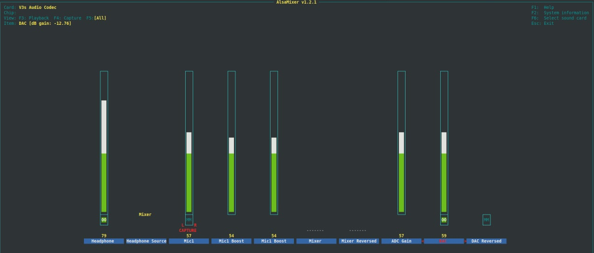

## How to use

For instance if you like to build variant `licheepizero-dock`, you can start with the following bash script:

```bash
export TEMPLATECONF=$PWD/sources/meta-chai/conf/variant/licheepizero-dock
source sources/poky/oe-init-build-env build

bitbake chai-image
```

## how to use zero-dock mic

First of all, the v3s audio coded has no MIC1 bias. Instead, it looks to me like an differential input. I was able to get the mic working by changing the MIC setting from single ended to Left/Right within `alsamixer`.



For easy verification, use the _chai-audio-image_ with the alsa-tools. Just plugin your headphone, setup ALSA like the picture above and run `alsaloop` and verify the microphone 😎️
